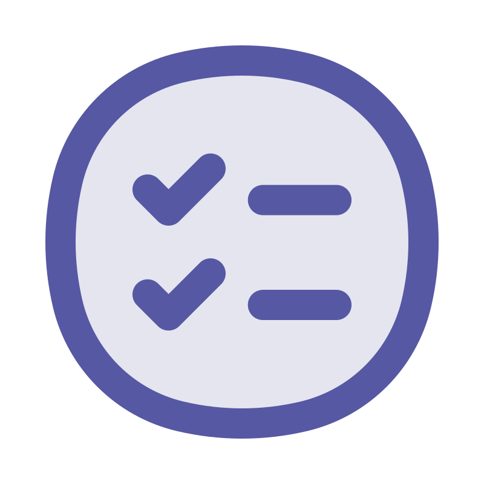
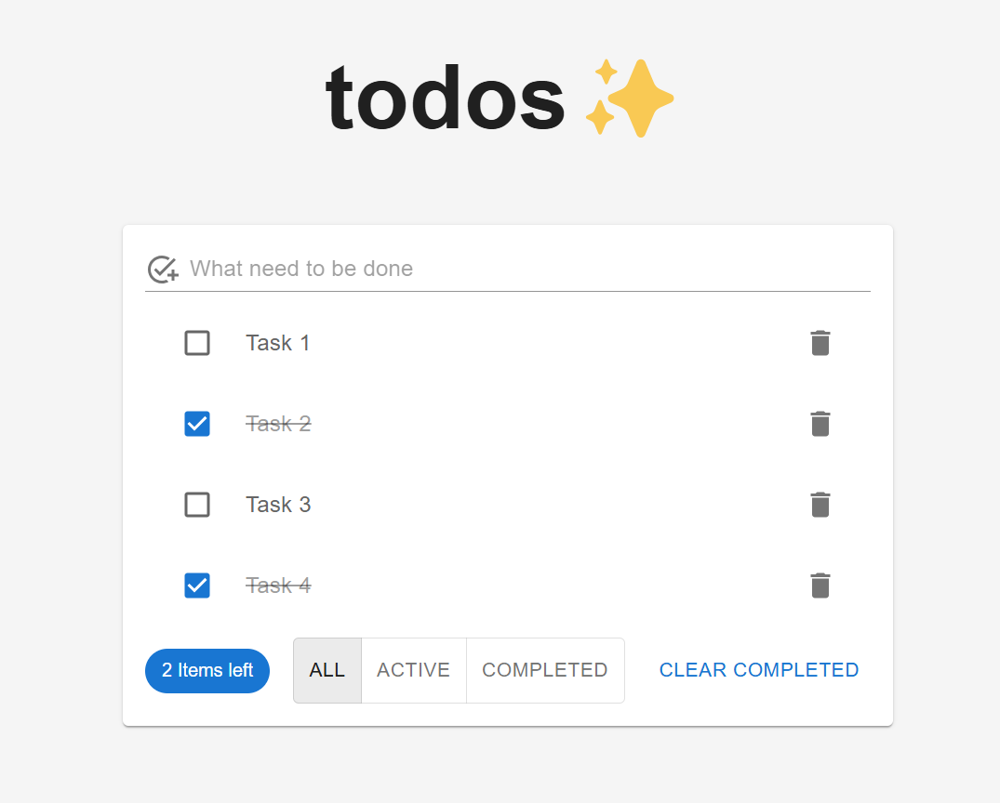

# README.md

<a name="readme-top"></a>

<div align="center">
  <a href="https://github.com/othneildrew/Best-README-Template">
    
  </a>
  <h3 align="center">Todolist App</h3>
  <p align="center">
    Демонстрация тестового приложения
    <br />
    <br />
    <a href="https://github.com/othneildrew/Best-README-Template" target="_blank" >Открыть демо</a>
  </p>
</div>

## О проекте



<p style="margin-block: 1rem">ToDo-приложение, позволяющее управлять текущим списком дел.</p>

Элементы интерфейса:

<ul>
  <li>Поле для ввода новой задачи</li>
  <li>Списки задач:
    <ul>
      <li>общий</li>
      <li>невыполненных задач</li>
      <li>выполненных задач</li>
    </ul>
  </li>
  <li>Количество оставшихся задач</li>
  <li>Очистка выполненных</li>
</ul>

### Стек

Приложение создано с использованием <a href="https://www.typescriptlang.org" target="_blank" title="https://www.typescriptlang.org">TypeScript</a>, <a href="https://react.dev" target="_blank" title="https://react.dev">React</a> и <a href="https://react.dev/reference/react/hooks" target="_blank" title="https://react.dev/reference/react/hooks">React Hooks</a>.
<br />
Библиотека компонент - <a href="https://mui.com/material-ui/getting-started" target="_blank" title="https://mui.com/material-ui/getting-started">MUI</a>.
<br />
Покрытие тестами - <a href="https://jestjs.io" target="_blank" title="https://jestjs.io/">Jest</a>.

## Запуск

Проект развернут с помощью Vite v6.0.5.
Чтобы запустить проект, следуйте следующей инструкции.

### Установка

Вы можете локально запустить проект. Для этого:

1. Откройте терминал в папке, куда следует загрузить копию
2. Клонируйте репозиторий

```sh
git clone https://github.com/stepanovnikita13/todo-test.git
```

3. Установите зависимости

```sh
npm i
```

4. Выполните запуск

```sh
npm run start
```

<p align="right">(<a href="#readme-top">back to top</a>)</p>
